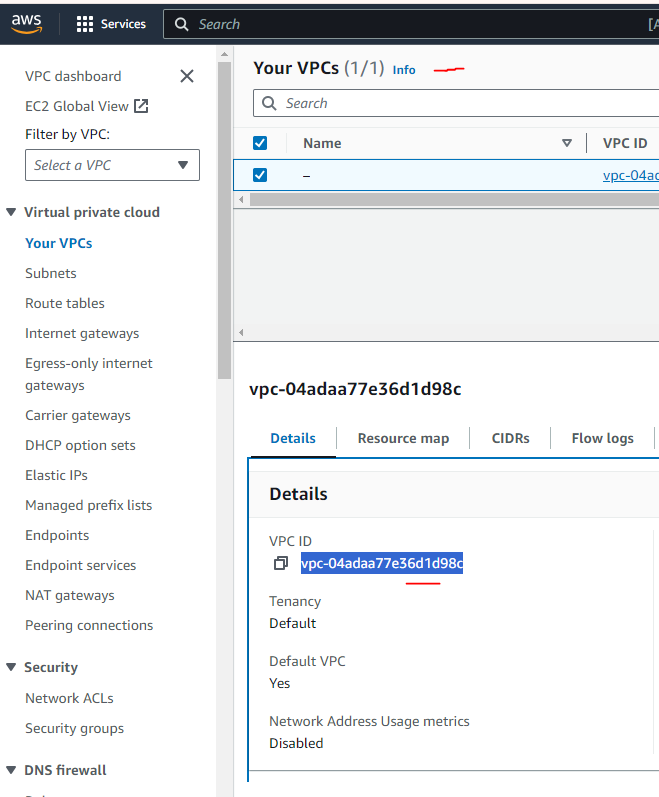

# lanchonete-da-rua-iac

## Esse repositorio é responsavel por criar

. Elastic Container Registry

. Fila de mensagens (SQS)

## Passos para executar infraestrutura

1) Obtenha o nome da vpc na amazon (vpc-04adaa77e36d1d98c)

2) substitua as informações de vpc e subnets no arquivo main.tf

2) Execute o comando [terraform init]

3) Execute o comando [terraform plan]

3) Execute o comando [terraform apply]